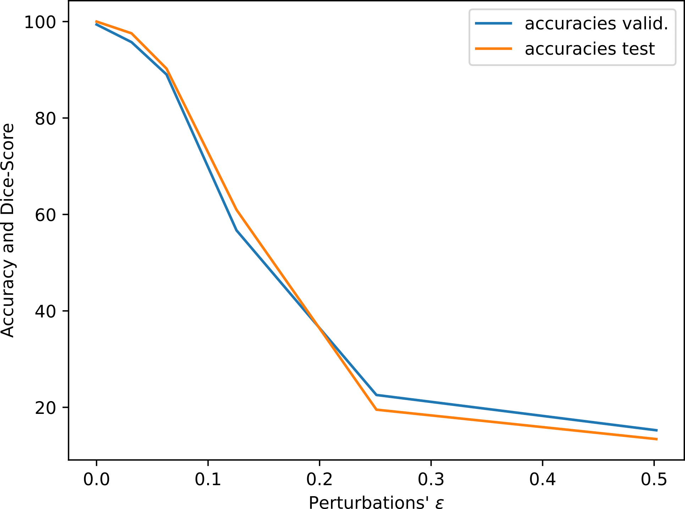
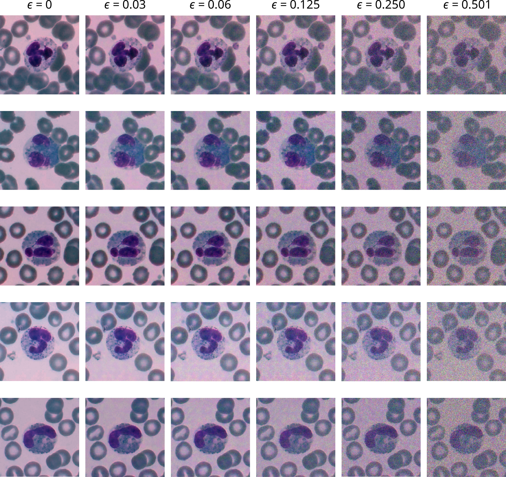
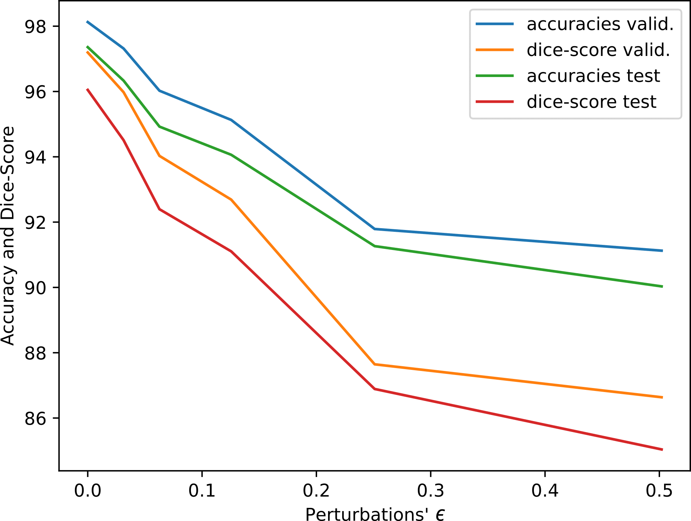
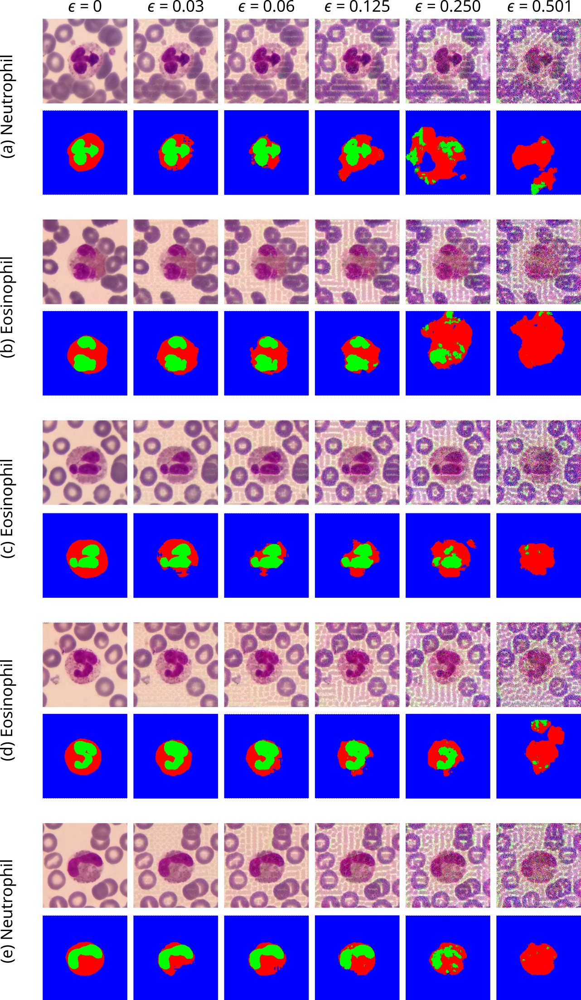

# Attacking White-Blood-Cells

## Routine to perform adversarial attacks in a UResNet50 for White-Blood-Cells segmentation

These routines use Torchattacks and Cleverhans libraries to attack classification and segmentation pre-trained models with accuracies of 99.29% and 97% in the classification of white blood cells (WBC) and in the segmentation of their cytoplasm and nuclei, respectively, on the blood stained slides images from Raabin-WBC Datasets. In these cases we used the PGD method (Projected Gradient Descent) in a white box attack, but a diverse range of attacks can be conduced using these same files, only changing the function called at the 'atk' object to the desired attack method. See Torchattacks and Cleverhans documentation for more information.

The 'main.py' file can only run with other three python files, named 'utils.py', with the utils functions to be used, 'dataset.py' to load the dataset images to a torch DataLoader, and 'model.py' where acctualy the model is. There is also a supplementary 'train.py' file, which can be used to conduct the training of the model described in 'model.py'. Any other model or dataset can be implemented using the same files ('train.py' and 'utils.py'), just changing the 'model' method in 'train.py' to the desired method (e.g. imported from torchvision.models), and the 'dataset.py' file to load the desired dataset (for both offline or online datasets).

## Results from Classification Attacks

### Classification Attacks

Attacks performed in a ResNet50 classification model trained to detect types of white blood cells showed accuracy dropping for epsilons greater than 0.1, as we can see by Fig. 1. Examples of original and perturbed images can be seen in Fig. 2.

<!--  -->

Figure 1 - Accuracies obtained for the classification model ResNet50 under attack, for the validation and the test data sets, considering different values of ε.

Figure 2 - Example of non-perturbed and perturbed images for different values of ε.

### Segmentation Attacks

Attacks in a UResNet50 (UNet with ResNet encoder and decoder part) segmentation model resulted in less accuracy and dice-score dropping, showing that this model is more robust for this type of attacks (Fig. 3). Fig. 4 shows original and perturbed images exemples.

<!--  -->

Figure 3 - Accuracy and Dice-Score curve, obtained for the segmentation task, for a UResNet50 model attacked in both the validation and the test data sets, for different values of ε.

Figure 4 - Examples of perturbed images, and the resulting labels, for different values of ε.